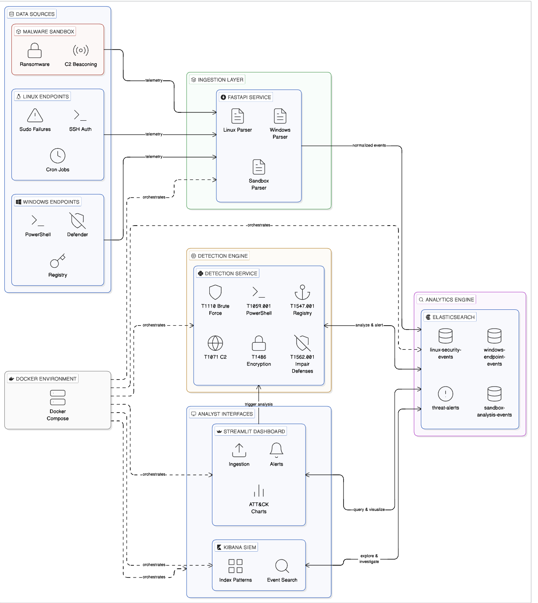
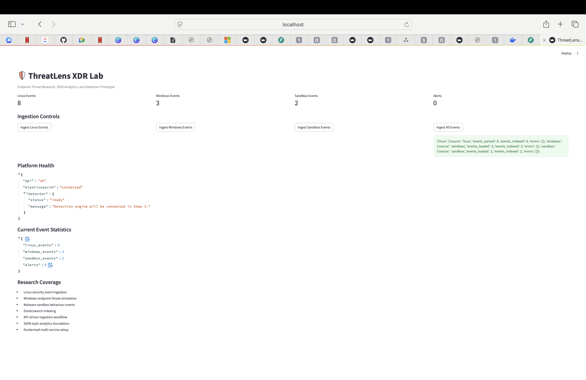
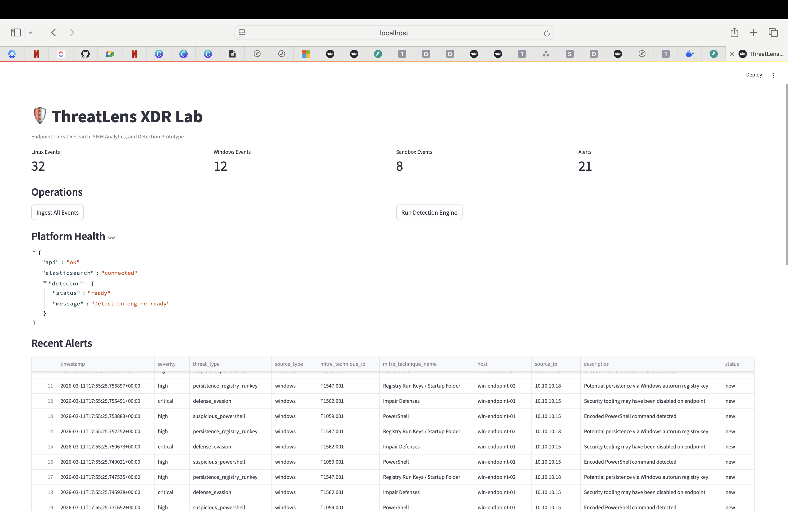

# ThreatLens XDR Lab

ThreatLens XDR Lab is a containerised endpoint threat detection and security analytics platform designed to simulate how modern security teams ingest telemetry, analyse suspicious behaviour, and detect threats across multiple endpoint environments.

The project demonstrates how security telemetry from Linux systems, Windows endpoints, and malware sandbox environments can be collected, normalised, analysed, and visualised through a threat detection pipeline mapped to MITRE ATT&CK techniques.

The platform integrates multiple technologies commonly used in modern security operations environments, including Python, FastAPI, Elasticsearch, Kibana, Docker, and Streamlit.

---

## System Architecture

ThreatLens XDR Lab follows a layered security analytics architecture that separates telemetry sources, ingestion, detection, analytics, and analyst-facing interfaces. Security events flow from simulated endpoint environments into an ingestion service, are normalised and indexed in Elasticsearch, analysed by a detection engine, and finally visualised through Streamlit and Kibana.



The platform collects security telemetry from three major sources: Linux endpoints, Windows endpoints, and a malware sandbox simulation environment. These events are processed by a FastAPI ingestion service responsible for parsing and normalising telemetry before storing it in Elasticsearch. A Python detection engine applies behavioural rules to identify suspicious activity such as brute-force attacks, PowerShell abuse, registry persistence, defence evasion, ransomware-like encryption, and command-and-control beaconing. Generated alerts are mapped to MITRE ATT&CK techniques and made available to analysts through both a Streamlit dashboard and Kibana SIEM interface. The entire environment is deployed with Docker Compose to provide a reproducible multi-service security analytics platform.

---

## Screenshots

The screenshots below show the working analyst dashboard, detection results, and threat analytics visualisations produced by ThreatLens XDR Lab.

### Dashboard Overview

This view shows the main analyst dashboard with ingested event counts, alert totals, operational controls, and platform health.



### Recent Alerts Table

This section displays generated alerts with severity, threat type, source, MITRE ATT&CK mappings, affected hosts, source IP addresses, and analyst-facing descriptions.



### Threat Analytics Charts

This section visualises alert distributions by severity, MITRE ATT&CK technique, and source type, helping analysts quickly understand patterns across the environment.


---

## Key Features

ThreatLens XDR Lab demonstrates several important security analytics capabilities including multi-source telemetry ingestion, rule-based threat detection, MITRE ATT&CK mapping, alert generation, and security analytics visualisation.

The system simulates endpoint security monitoring by collecting events from Linux system logs, Windows endpoint activity, and malware sandbox analysis. These events are normalised into a consistent structure and indexed in Elasticsearch, which acts as the platform’s security analytics datastore.

A Python detection engine analyses indexed events and generates alerts based on suspicious behaviour patterns such as brute-force authentication attempts, encoded PowerShell execution, registry persistence mechanisms, security tool tampering, command-and-control communications, and ransomware-like encryption activity.

All alerts are mapped to relevant MITRE ATT&CK techniques to demonstrate how detection engineering workflows can align with threat intelligence frameworks used by modern security teams.

---

## Data Sources

The platform simulates telemetry from three primary endpoint environments.

Linux endpoints provide system log events such as SSH authentication attempts, sudo authentication failures, and suspicious cron job activity that may indicate persistence mechanisms or privilege escalation attempts.

Windows endpoints simulate behaviour commonly observed during attacks including encoded PowerShell commands, registry autorun persistence techniques, and the disabling of security tools such as Windows Defender.

The malware sandbox component simulates dynamic malware behaviour including ransomware-like mass file encryption activity and repeated command-and-control beaconing behaviour.

These events are processed by the ingestion service and indexed for security analytics.

---

## Detection Engine

The detection engine analyses indexed events and generates alerts when suspicious patterns are identified. Detection rules are mapped to MITRE ATT&CK techniques to reflect real-world threat detection strategies used by security operations teams.

Examples of simulated detections include SSH brute-force attacks, malicious PowerShell execution, persistence through registry autorun keys or cron jobs, defence evasion through disabling security tools, ransomware-style encryption behaviour, and command-and-control beaconing activity.

Detected threats are written to the `threat-alerts` index in Elasticsearch where they can be analysed by analysts or visualised through dashboards.

---

## MITRE ATT&CK Techniques Demonstrated

ThreatLens XDR Lab demonstrates several MITRE ATT&CK techniques commonly associated with endpoint compromise and post-exploitation behaviour.

The project includes mappings such as:

- **T1110** – Brute Force  
- **T1059.001** – PowerShell  
- **T1547.001** – Registry Run Keys / Startup Folder  
- **T1562.001** – Impair Defenses  
- **T1486** – Data Encrypted for Impact  
- **T1071** – Application Layer Protocol  

These mappings help demonstrate how security detections can be aligned with recognised adversary behaviour frameworks.

---

## Analytics and Visualisation

ThreatLens XDR Lab provides two primary interfaces for interacting with the platform.

The Streamlit dashboard provides an operational view of the platform including event ingestion controls, detection engine execution, alert tables, MITRE ATT&CK analytics, and charts showing alert severity and source distribution.

Kibana acts as the SIEM exploration environment where analysts can search indexed events, investigate alerts, and explore telemetry stored in Elasticsearch.

Together these interfaces simulate the workflow used by security analysts when investigating endpoint threats.

---

## Technology Stack

ThreatLens XDR Lab integrates multiple technologies commonly used in modern security analytics systems.

Python is used to build the ingestion services, event parsers, and detection engine. FastAPI provides the API framework responsible for collecting telemetry and triggering detection logic. Elasticsearch serves as the central security analytics engine and stores all indexed security events and alerts. Kibana provides the SIEM interface used for event exploration and investigation.

Streamlit is used to build the analyst dashboard that visualises threat activity and alert analytics. Docker and Docker Compose orchestrate the entire multi-service environment and allow the platform to run consistently across development environments.

---

## Project Structure

The project is organised into several components that represent the different layers of the security analytics pipeline.

```text
threatlens-xdr/
├── api/
│   ├── main.py
│   ├── detector.py
│   ├── elastic_client.py
│   ├── config.py
│   └── schemas.py
├── collectors/
│   ├── linux_log_collector.py
│   ├── windows_event_simulator.py
│   └── sandbox_event_generator.py
├── analytics/
│   └── sample_events/
│       ├── auth.log
│       ├── windows_events.json
│       └── sandbox_events.json
├── dashboard/
│   └── app.py
├── infra/
│   ├── docker-compose.yml
│   ├── Dockerfile.api
│   └── Dockerfile.dashboard
├── diagrams/
│   └── threatlens-architecture.png
├── screenshots/
│   ├── dashboard-overview.png
│   ├── alerts-table.png
│   └── analytics-charts.png
├── requirements.txt
├── README.md
└── .gitignore